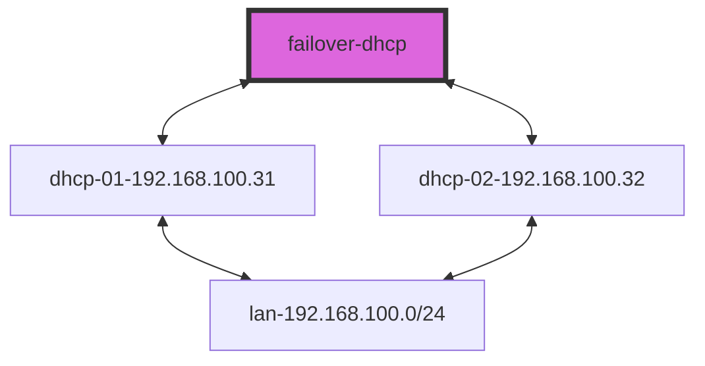

[Network plan]



[Manual]\
["https://redos.red-soft.ru/base/server-configuring/dhcp/failover-dhcp/", "https://infra.gnulinux.pro/ru/latest/infra/11/11._DHCP_сервер_ч.2.html#id1", "https://wikival.bmstu.ru/doku.php?id=сервис_dhcp&s[]=dhcp", "https://interface31.ru/tech_it/2022/07/nastraivaem-otkazoustoychivyy-dhcp-server-na-baze-isc-dhcp.html", "https://docs.eltex-co.ru/pages/viewpage.action?pageId=17859921", "https://www.opennet.ru/tips/2349_dns_bind_dhcp_dyndns.shtml", "https://www.linuxmaker.com/en/linux/dynamic-dns-ddns/troubleshooting-ddns.html"]
	
[Install]\
Установка отказоустойчивого DHCP сервера на Linux может быть достигнута с использованием пакета Internet Systems Consortium DHCP в сочетании с DHCP Failover механизмом.\
Этот механизм позволяет двум серверам совместно обслуживать один диапазон адресов, что обеспечивает непрерывную работу даже при выходе из строя одного из серверов.\
Ниже приводится пошаговая инструкция по настройке отказоустойчивого DHCP сервера на двух серверах (dhcp-01 и dhcp-02).

Шаг 1: Установка ISC DHCP сервера\
На обоих серверах установите пакет ISC DHCP:
```bash
sudo yum update -y
sudo yum install -y dhcp-server
```

Шаг 2: Настройка конфигурационных файлов\
Конфигурация на dhcp-01\
Откройте файл конфигурации /etc/dhcp/dhcpd.conf для редактирования:\
Добавьте или измените следующие строки:

```yaml
failover peer "failover-dhcp" {
  primary; # Определяет главный сервер 
  address 192.168.100.31; # адрес первичного сервера
  port 647;
  peer address 192.168.100.32; # адрес вторичного сервера
  peer port 647;
  max-response-delay 60;
  max-unacked-updates 10;
  mclt 3600;
  split 128;
  load balance max seconds 3;
}

authoritative;
default-lease-time 86400; # 1 день 
max-lease-time 86400; # 1 день 
update-static-leases on;
one-lease-per-client on;

omapi-port 7911;
omapi-key omapi_key;
key omapi_key {
     # сформируйте секретный ключ с помощью любого генератора, указав тип шифрования hmac-md5
     algorithm hmac-md5;
     secret your_generated_key; 
}

subnet 192.168.100.0 netmask 255.255.255.0 {
  option subnet-mask 255.255.255.0;
  option broadcast-address 192.168.0.255;
  option routers 192.168.100.1;
  option domain-name-servers redos.test;
  option domain-search "redos.test";
  pool {
    failover peer "failover-dhcp";
    range 192.168.100.33 192.168.100.34;
  }
}
```
Конфигурация на dhcp-02\
Откройте файл конфигурации /etc/dhcp/dhcpd.conf для редактирования:\
Добавьте или измените следующие строки:
```yaml
failover peer "failover-dhcp" {
  secondary; # определитель вторичного сервера
  address 192.168.100.32; # адрес первичного сервера
  port 647;
  peer address 192.168.100.31; # адрес вторичного сервера
  peer port 647;
  max-response-delay 60;
  max-unacked-updates 10;
  load balance max seconds 3;
}

authoritative;
default-lease-time 86400; # 1 день 
max-lease-time 86400; # 1 день 
update-static-leases on;
one-lease-per-client on;

omapi-port 7911;
omapi-key omapi_key;
key omapi_key {
     # сформируйте секретный ключ с помощью любого генератора, указав тип шифрования hmac-md5
     algorithm hmac-md5;
     secret your_generated_key;
}

subnet 192.168.100.0 netmask 255.255.255.0 {
  option subnet-mask 255.255.255.0;
  option broadcast-address 192.168.0.255;
  option routers 192.168.100.1;
  option domain-name-servers redos.test;
  option domain-search "redos.test";
  pool {
    failover peer "failover-dhcp";
    range 192.168.100.33 192.168.100.34;
  }
}
```
Шаг 3: Настройка службы DHCP\
Настройте, чтобы служба DHCP использовала правильный интерфейс.\
Откройте файл vi /etc/sysconfig/dhcpd и укажите нужный интерфейс:\
Измените строку:
```yaml
DHCPDARGS="enp0s3"
```
Замените eth0 на имя сетевого интерфейса, который вы используете.

Шаг 4: запуск службы DHCP\
После настройки конфигурационных файлов запустите службы DHCP на обоих серверах:
```bash
sudo  systemctl start dhcpd
sudo  systemctl enable dhcpd
```
Шаг 5: Проверка статуса службы
Убедитесь, что службы DHCP работают корректно на обоих серверах:
```bash
sudo systemctl status dhcpd
```

[Troubleshooting]

1. Использование команды omshell\
Команда omshell (OMAPI shell) позволяет взаимодействовать с сервером DHCP и запрашивать состояние failover.\
Вот пример использования omshell для проверки состояния failover:\
Откройте omshell:\
Подключитесь к DHCP серверу (замените localhost на IP-адрес вашего сервера, если необходимо):
```console
omshell
> server localhost
> port 7911
Установите ключ для аутентификации (если используется):
omshell
> key omapi_key your_key_here
> connect
Запросите объект failover:
omshell
> new failover-state
> set name = "dhcp-failover"
> open
> show
```
Эта команда покажет текущее состояние failover на сервере.\
Повторите процесс на обоих серверах, чтобы убедиться, что они оба взаимодействуют корректно.

2. Использование команды dhcpd-pools\
Команда dhcpd-pools позволяет просмотреть распределение адресов и статус failover в удобочитаемом виде.\
Для установки dhcpd-pools на Redos:
```bash
sudo yum install -y dhcpd-pools
```
После установки запустите команду для анализа конфигурации DHCP:
```bash
dhcpd-pools -c /etc/dhcp/dhcpd.conf -l /var/lib/dhcp/dhcpd.leases
```
Эта команда покажет информацию о состоянии пулов адресов и статус failover.

3. Проверка состояния через netstat\
Вы можете использовать netstat для проверки, слушает ли сервер на порту failover (обычно 647):
```bash
sudo netstat -tulnp | grep dhcpd
```
Вы должны увидеть строку, указывающую на то, что dhcpd слушает на порту 647, что подтверждает активное состояние failover.

4. Проверка работоспособности через тестирование\
Окончательная проверка включает в себя отключение одного из серверов и проверку, что второй сервер берет на себя обслуживание клиентов.

Отключите isc-dhcp-server на одном из серверов:
```bash
sudo systemctl stop dhcpd
```

Запросите новый IP-адрес на клиенте (например, перезагрузите сетевой интерфейс):
```bash
sudo dhclient -v
```
Проверьте логи на работающем сервере, чтобы убедиться, что он обслуживает запросы клиентов.
Повторите процесс, отключив другой сервер, чтобы убедиться, что оба сервера могут корректно заменять друг друга.
Эти шаги помогут вам убедиться, что ваши DHCP серверы корректно взаимодействуют в режиме отказоустойчивости и могут обслуживать клиентов без прерывания даже при выходе из строя одного из серверов.

5. Проверьте конфигурационный файл
```bash
dhcpd -t -cf /etc/dhcp/dhcpd.conf
```

[Security]\
OMAPI (Object Management API)\
Используйте OMAPI для безопасного управления сервером DHCP. Создайте ключ для OMAPI и добавьте его в конфигурацию.\
Создание ключа OMAPI:
```bash
sudo omapi-keygen
```
или

```bash
tsig-keygen DHCP.OMAPI > /root/dhсp_omapi.key
```
Добавьте ключ в /etc/dhcp/dhcpd.conf:
```yaml
key omapi_key {
    algorithm hmac-md5;
    secret "your_generated_key";
};

omapi-port 7911;
```

[Backup]\
Настройте регулярное резервное копирование конфигурационных файлов и баз данных аренды IP-адресов.\
Пример резервного копирования с использованием cron и tar:

Создайте скрипт резервного копирования:
```yaml
#!/bin/bash
tar -czf /backup/dhcpd-backup-$(date +\%F).tar.gz /etc/dhcp /var/lib/dhcp
```
Сделайте его исполняемым:
```bash
chmod +x /path/to/backup-script.sh
```
Настройте задание cron для ежедневного выполнения:
```bash
sudo crontab -e
```
Добавьте строку:
```yaml
0 2 * * * /path/to/backup-script.sh
```
Если хотим исключить подсети просто определяем сеть без параметров.
```yaml
subnet 192.168.100.0 netmask 255.255.255.0 {
not authoritative;
}
subnet 192.168.101.0 netmask 255.255.255.0 {
  option subnet-mask 255.255.255.0;
  option broadcast-address 192.168.101.255;
  option routers 192.168.101.1;
  option domain-name-servers redos.test;
  option domain-search "redos.test";
  pool {
    failover peer "failover-dhcp";
    range 192.168.101.33 192.168.101.34;
  }
}
```
Настройка обновления зон.
```yaml

ddns-update-style interim;
ddns-ttl 60;
ddns-updates on;
dyndns_update_ptr = true;
dyndns_refresh_interval = 60;
update-static-leases on;
ddns-domainname "redos.test";
ddns-rev-domainname "in-addr.arpa.";
allow client-updates;

...
subnet 192.168.X.0 netmask 255.255.255.0 {

### ubuntu
#include "/etc/dhcp/rndc.key";

### freebsd
#include "/usr/local/etc/rndc.key";

  zone redos.test. {
    primary 192.168.X.10;
    key rndc-key;
  }
  zone X.168.192.in-addr.arpa. {
    primary 192.168.X.10;
    key rndc-key;
  }
```
Для диагностики и просмотра арендованных адресов в **ISC DHCP Server** (классическая версия, не `dhcpd`) можно использовать следующие утилиты и методы:

---

### 1. **Просмотр арендованных адресов**
Файл аренды DHCP-адресов обычно находится в `/var/lib/dhcp/dhcpd.leases` (или `/var/lib/dhcpd/dhcpd.leases` в некоторых дистрибутивах).  
Для просмотра текущих аренд можно использовать:

```bash
cat /var/lib/dhcp/dhcpd.leases
```

Или с фильтрацией активных аренд:

```bash
grep -A 9 "lease " /var/lib/dhcp/dhcpd.leases | grep -E "lease|starts|ends|hardware|client-hostname"
```

---

### 2. **Утилита `dhcp-lease-list` (если установлена)**
Некоторые системы предоставляют утилиту для удобного просмотра аренд:

```bash
dhcp-lease-list
```

(Требует установки пакета `dhcp-lease-list` или аналога.)

---

### 3. **Перезагрузка сервера DHCP для диагностики**
Если нужно применить изменения или проверить конфигурацию:

```bash
sudo systemctl restart isc-dhcp-server
```

Проверить статус:

```bash
sudo systemctl status isc-dhcp-server
```

---

### 4. **Проверка логов DHCP**
Логи могут содержать информацию о выдаче адресов и ошибках:

```bash
journalctl -u isc-dhcp-server -f
```

Или просмотр логов из файла:

```bash
tail -f /var/log/syslog | grep dhcpd
```

---

### 5. **Утилита `dhcpdump` (для анализа трафика)**
Можно установить `dhcpdump` для мониторинга DHCP-трафика в реальном времени:

```bash
sudo apt install dhcpdump  # Для Debian/Ubuntu
sudo dhcpdump -i eth0      # Заменить eth0 на нужный интерфейс
```

---

### 6. **Проверка конфигурации перед запуском**
Перед перезагрузкой сервера можно проверить конфигурацию:

```bash
sudo dhcpd -t
```

(Если ошибок нет, значит, синтаксис корректен.)

---

### 7. **Просмотр статистики сервера**
Некоторые версии `dhcpd` поддерживают вывод статистики:

```bash
echo "statistics" | sudo socat unix-connect:/var/run/dhcpd.sock stdio
```

(Требует настройки управления через сокет в `dhcpd.conf`.)

---

Если вы используете **Kea DHCP** (более современная альтернатива ISC DHCP), то там свои утилиты, например:

```bash
kea-ctrl-agent -c /etc/kea/kea-ctrl-agent.conf
```

---

Какой именно DHCP-сервер у вас работает (`isc-dhcp-server` или `kea`), можно проверить так:

```bash
ps aux | grep -E "dhcpd|kea"
```
